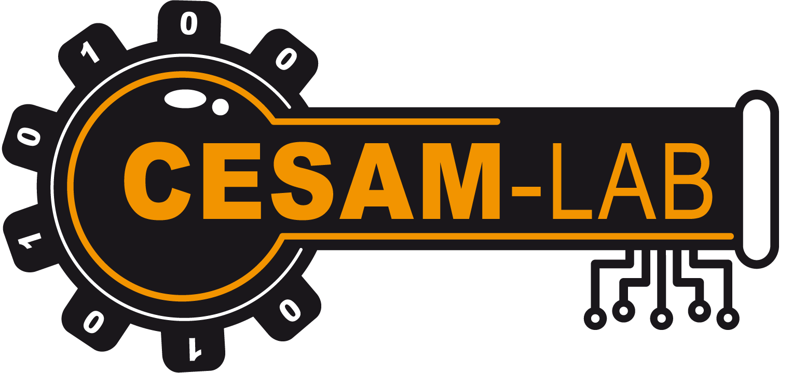

<p align="center">
  <picture>
    <source media="(prefers-color-scheme: dark)" srcset="pic/Logo-CESAM-Couleur-vect-dark.png">
    
  </picture>
</p>

# cesam-tools — Caja de herramientas CESAM-Lab

*🌍 [English](README.md) · [Français](README.fr.md) · [Deutsch](README.de.md) · **Español** · [Italiano](README.it.md) · [Português](README.pt.md) · [Nederlands](README.nl.md) · [Polski](README.pl.md)*

<p align="center">
  <a href="https://github.com/CESAMLAB/cesam-tools/releases/latest"></a>
  <a href="LICENSE"></a>
</p>

Workspace Rust que agrupa las **herramientas de CESAM-Lab**, empezando por
**simuladores de instrumentos industriales**: equipos virtuales que
reproducen un comportamiento físico realista y se comunican mediante protocolos
de campo. Útil para desarrollar, probar y demostrar supervisores, autómatas
o pasarelas **sin hardware real**.

> Distribuido gratuitamente bajo licencia [MIT](LICENSE).

## Instrumentos disponibles

| Crate | Producto | Descripción | Protocolo | IHM |
|-------|---------|-------------|-----------|-----|
| [`mock_bin_ru_modbustcp`](mock_bin_ru_modbustcp) | **ORME** | Regulador (PID / TOR / PWM) sobre función de transferencia | Modbus TCP & RTU (esclavo) | egui |

Biblioteca compartida:

| Crate | Descripción |
|-------|-------------|
| [`mock_lib_control`](mock_lib_control) | Bloques de regulación reutilizables: PID anti-windup, todo-o-nada con histéresis, proceso de 1.er orden + retardo puro (FOPDT). |

## ORME — el regulador simulado

<p align="center">
  
</p>

> **ORME** — *Open Regulator Modbus Emulator*. **«Abra el bus.»**
> Un regulador de campo que solo existe en su bus Modbus.

Un regulador industrial virtual completo:

- **Proceso** modelado mediante una función de transferencia de primer orden con
  retardo puro `K·e^(-Ls) / (1 + T·s)` (típico de un horno o baño termostatizado).
- **Regulación** bidireccional: sentido 1 (calor) y sentido 2 (frío),
  cada uno configurable en **PID**, **todo-o-nada (TOR)** o **relé de ciclo (PWM)**.
- **Modos** marcha/paro y automático/manual.
- **Servidor Modbus** en **TCP** o **RTU serie / RS485** (feature `rtu`), a elección.
  Tabla de direcciones (consigna, medida, salida, modos…), **lista blanca de IP**
  (comodines `*`) configurable en caliente, y **política de maestro único** (un solo maestro
  remoto a la vez; en TCP un recién llegado desconecta al anterior).
- **Interfaz gráfica** en una página: control, **curva de tendencia**
  en tiempo real, **tabla de direcciones Modbus en vivo**, y un **modal de Parámetros**
  (transporte TCP/RTU, puerto, IP autorizadas, parámetros serie, función de
  transferencia, límites de consigna).
- **Configuración persistida** en formato TOML (`mock_ru_modbustcp.toml`),
  recargada al arranque, con botón de restablecimiento a los valores por defecto.

### Arquitectura asíncrona

```
        Command (cast no bloqueante)            instantánea compartida
  IHM (egui) ──────────────────────►  SimulationActor  ──────────►  IHM (lectura)
  Modbus escritura ────────────────►   (ractor)         ──────────►  imagen Modbus
  Modbus lectura  ◄──────────────────────────────────────  imagen Modbus
```

- **`ractor`**: un actor único posee el estado del regulador; todas las
  mutaciones pasan por mensajes (sin bloqueo sobre la lógica de negocio).
- **`tokio-modbus`**: servidor Modbus TCP y RTU serie (trait `Service`).
- **`eframe`/`egui`**: interfaz gráfica en el hilo principal.

## Descarga

Hay binarios precompilados disponibles en la página de [**Releases**](https://github.com/CESAMLAB/cesam-tools/releases/latest) — **sin necesidad de la cadena de herramientas Rust**.

| Plataforma | IHM | Headless (solo TCP, sin IHM) |
|------------|-----|------------------------------|
| Linux x86_64 | [`orme-linux-x86_64`](https://github.com/CESAMLAB/cesam-tools/releases/latest/download/orme-linux-x86_64) | [`orme-linux-x86_64-headless`](https://github.com/CESAMLAB/cesam-tools/releases/latest/download/orme-linux-x86_64-headless) |
| Windows x86_64 | [`orme-windows-x86_64.exe`](https://github.com/CESAMLAB/cesam-tools/releases/latest/download/orme-windows-x86_64.exe) | — |
| Raspberry Pi arm64 (Pi OS 64 bits) | [`orme-rpi-arm64`](https://github.com/CESAMLAB/cesam-tools/releases/latest/download/orme-rpi-arm64) | [`orme-rpi-arm64-headless`](https://github.com/CESAMLAB/cesam-tools/releases/latest/download/orme-rpi-arm64-headless) |

```bash
chmod +x orme-linux-x86_64        # Linux / Raspberry Pi
./orme-linux-x86_64
```

Los binarios Linux/RPi están enlazados dinámicamente con glibc y necesitan un entorno de escritorio (X11/Wayland) para la IHM. En **Wayland**, instala la entrada de escritorio para el icono en la barra de tareas: `scripts/install-desktop.sh`. Verifica la integridad con las sumas de comprobación publicadas:

```bash
sha256sum -c SHA256SUMS
```

## Arranque rápido

```bash
# Requisitos previos: Rust stable (edición 2021, >= 1.85).
# Dependencias del sistema Linux para la IHM: libxkbcommon, libwayland/xcb, openGL.

cargo run -p mock_bin_ru_modbustcp
```

La ventana se abre y el servidor Modbus TCP escucha en `0.0.0.0:5502`.
El **puerto**, la **IP de escucha** y la **lista blanca de IP** se ajustan en el
modal **⚙ Parámetros** (aplicado en caliente) y luego se **persisten** en
`mock_ru_modbustcp.toml`. El **idioma de la interfaz** (francés, inglés,
alemán, español, italiano, portugués, neerlandés, polaco) se elige en ese
mismo modal y se persiste. Para usar otro archivo de configuración:

```bash
MOCK_CONFIG=/ruta/a/ma_config.toml cargo run -p mock_bin_ru_modbustcp
```

### Probar el enlace Modbus

Con cualquier cliente Modbus (ej. `mbpoll`):

```bash
# Poner en marcha (bobina 0) y luego leer la medida (input registers 0-1, f32)
mbpoll -m tcp -a 1 -t 0 -p 5502 127.0.0.1 1      # escribir la bobina On/Off
mbpoll -m tcp -a 1 -t 3:float -r 1 -p 5502 127.0.0.1   # leer PV (f32)
```

La tabla de direcciones completa está documentada en
[`mock_bin_ru_modbustcp/src/map.rs`](mock_bin_ru_modbustcp/src/map.rs).

## Desarrollo

```bash
cargo test --workspace      # tests unitarios + integración
cargo clippy --workspace    # lint
```

Ver [CLAUDE.md](CLAUDE.md) para las convenciones y la arquitectura detallada.

## Documentación

Cada instrumento tiene su propia documentación en su subcarpeta `docs/`,
disponible en ocho idiomas (`docs/<idioma>/`). Para el regulador (versión
española):

- [**Manual de usuario**](mock_bin_ru_modbustcp/docs/es/manuel_utilisateur.md) — primeros pasos, IHM, parámetros, FAQ.
- [Documento de diseño](mock_bin_ru_modbustcp/docs/es/conception.md) — arquitectura y decisiones técnicas.
- [Tabla de direcciones Modbus](mock_bin_ru_modbustcp/docs/es/table_modbus.md) — plan de direccionamiento completo.
- [Mantenimiento del software](mock_bin_ru_modbustcp/docs/es/maintenance.md) — build, configuración, ampliación, resolución de problemas.

## Marca y logotipos

Los logotipos están en [`pic/`](pic/):

- [`orme-icon.svg`](pic/orme-icon.svg) / `orme-icon.png` — icono ORME (esfera),
  también embebido como icono de ventana de la aplicación.
- [`orme-logo.svg`](pic/orme-logo.svg) — logotipo ORME completo (icono + texto).
- [`Logo-CESAM-Couleur-vect.png`](pic/Logo-CESAM-Couleur-vect.png) — logotipo CESAM-Lab.

El icono ORME se **genera** a partir de [`pic/orme-logo.gen.py`](pic/orme-logo.gen.py)
(`python3 pic/orme-logo.gen.py` produce los `.svg`, a rasterizar después).

## Licencia

[MIT](LICENSE) © 2026 CESAM-Lab
