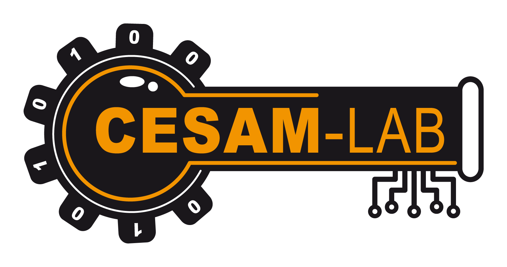

<p align="center">
  
</p>

# cesam-tools — Boîte à outils CESAM-Lab

*🌍 [English](README.md) · **Français** · [Deutsch](README.de.md) · [Español](README.es.md) · [Italiano](README.it.md) · [Português](README.pt.md) · [Nederlands](README.nl.md) · [Polski](README.pl.md)*

<p align="center">
  <a href="https://github.com/CESAMLAB/cesam-tools/releases/latest"></a>
  <a href="LICENSE"></a>
</p>

Workspace Rust regroupant les **outils de CESAM-Lab**, à commencer par des
**simulateurs d'instruments industriels** : des appareils virtuels qui
reproduisent un comportement physique réaliste et communiquent via des protocoles
de terrain. Utile pour développer, tester et démontrer des superviseurs, automates
ou passerelles **sans matériel réel**.

> Distribué gratuitement sous licence [MIT](LICENSE).

## Instruments disponibles

| Crate | Produit | Description | Protocole | IHM |
|-------|---------|-------------|-----------|-----|
| [`mock_bin_ru_modbus`](mock_bin_ru_modbus) | **ORME** | Régulateur (PID / TOR / PWM) sur fonction de transfert | Modbus TCP & RTU (esclave) | egui |
| [`mock_bin_su_namur`](mock_bin_su_namur) | **OSNE** | Agitateur de laboratoire à hélice : fonction de transfert du moteur, asservissement de vitesse rapide, charge visqueuse ajustable | NAMUR sur TCP & série RS-232 (esclave) | egui |
| [`mock_bin_ru_opcua`](mock_bin_ru_opcua) | **ORUE** | Régulateur de procédé (PID anti-emballement) sur procédé du premier ordre, avec sécurité OPC UA configurable | OPC UA (serveur) | egui |
| [`mock_bin_ru_sparkplugb`](mock_bin_ru_sparkplugb) | **ORSE** | Régulateur de procédé exposé en nœud périphérique MQTT Sparkplug B (sortant) | Sparkplug B / MQTT (client) | egui |
| [`mock_bin_ru_s7`](mock_bin_ru_s7) | **ORSS** | Régulateur de procédé exposé en serveur S7comm sur ISO-on-TCP (RFC1006) | S7comm (serveur) | egui |
| [`mock_bin_ru_ethernetip`](mock_bin_ru_ethernetip) | **OREE** | Régulateur de procédé exposé en adaptateur EtherNet/IP (messagerie explicite CIP) | EtherNet/IP (adaptateur) | egui |
| [`mock_bin_ru_pbdp`](mock_bin_ru_pbdp) | **ORPD** | Régulateur de procédé exposé en esclave PROFIBUS DP-V0 simulé sur liaison série | PROFIBUS DP (esclave, série) | egui |

Bibliothèque partagée :

| Crate | Description |
|-------|-------------|
| [`mock_lib_control`](mock_lib_control) | Briques de régulation réutilisables : PID anti-emballement, tout-ou-rien à hystérésis, procédé du 1ᵉʳ ordre + retard pur (FOPDT). |

## ORME — le régulateur simulé

<p align="center">
  
</p>

> **ORME** — *Open Regulator Modbus Emulator*. **« Ouvrez le bus. »**
> Un régulateur de terrain qui n'existe que sur votre bus Modbus.

Un régulateur industriel virtuel complet :

- **Procédé** modélisé par une fonction de transfert du premier ordre avec
  retard pur `K·e^(-Ls) / (1 + T·s)` (typique d'un four ou bain thermostaté).
- **Régulation** bidirectionnelle : sens 1 (chaud) et sens 2 (froid),
  chacun configurable en **PID**, **tout-ou-rien (TOR)** ou **relais à cycle (PWM)**.
- **Modes** marche/arrêt et automatique/manuel.
- **Serveur Modbus** en **TCP** ou **RTU série / RS485** (feature `rtu`), au choix.
  Table d'adresses (consigne, mesure, sortie, modes…), **liste blanche d'IP**
  (jokers `*`) configurable à chaud, et **politique mono-maître** (un seul maître
  distant à la fois ; en TCP un nouveau venu déconnecte le précédent).
- **Interface graphique** sur une page : pilotage, **courbe de tendance**
  temps réel, **table d'adresses Modbus live**, et un **modal Paramètres**
  (transport TCP/RTU, port, IP autorisées, paramètres série, fonction de
  transfert, bornes de consigne).
- **Configuration persistée** au format TOML (`mock_ru_modbus.toml`),
  rechargée au démarrage, avec bouton de réinitialisation aux valeurs par défaut.

### Architecture asynchrone

```
        Command (cast non bloquant)            instantané partagé
  IHM (egui) ──────────────────────►  SimulationActor  ──────────►  IHM (lecture)
  Modbus écriture ─────────────────►   (ractor)         ──────────►  image Modbus
  Modbus lecture  ◄──────────────────────────────────────  image Modbus
```

- **`ractor`** : un acteur unique possède l'état du régulateur ; toutes les
  mutations passent par messages (pas de verrou sur la logique métier).
- **`tokio-modbus`** : serveur Modbus TCP et RTU série (trait `Service`).
- **`eframe`/`egui`** : interface graphique sur le thread principal.

## OSNE — l'agitateur de laboratoire simulé

<p align="center">
  
</p>

> **OSNE** — *Open Stirrer NAMUR Emulator*.
> Un agitateur de laboratoire à hélice (style IKA) qui n'existe que sur votre
> liaison NAMUR.

Un agitateur de laboratoire virtuel complet :

- **Moteur** modélisé par une fonction de transfert rotationnelle `J·dω/dt = T −
  k·η·ω − frottement` (Euler explicite), avec un **PID rapide** pilotant le couple
  pour suivre la consigne de vitesse.
- **Viscosité ajustable** `η` : augmente le couple de charge ; à forte viscosité
  le moteur sature et la consigne devient inatteignable (**surcharge**) — comme un
  vrai agitateur.
- **Serveur NAMUR** (protocole de commandes ASCII) sur **TCP** (test sans
  matériel) ou **série RS-232** (feature `serial`), avec un **chien de garde** par
  session (`OUT_WD1@<m>`), une **politique mono-maître** et une **liste blanche
  d'IP** (TCP).
- **Interface graphique** sur une page : consigne de vitesse, viscosité, **courbe
  de tendance** vitesse/couple live, un **mini-terminal NAMUR** embarqué
  (envoyer/inspecter des trames avec historique des commandes), et un **modal
  Paramètres** (transport TCP/série, paramètres moteur, bornes, i18n 8 langues).
- **Configuration persistée** au format TOML (`mock_su_namur.toml`), rechargée au
  démarrage, avec bouton de réinitialisation aux valeurs par défaut.

Il partage l'architecture d'ORME (modèle métier synchrone, acteurs `ractor`, IHM
`egui`). Lancez-le avec `cargo run -p mock_bin_su_namur` ; le serveur NAMUR écoute
par défaut sur `0.0.0.0:4001`.

## ORUE — le régulateur OPC UA simulé

<p align="center">
  
</p>

> **ORUE** — *Open Regulator UA Emulator*. **« Unifiez le procédé. »**
> Un régulateur de procédé qui n'existe que sur votre espace d'adressage OPC UA.

Un régulateur de procédé virtuel complet :

- **Procédé** modélisé par une fonction de transfert du premier ordre piloté par un
  **PID anti-emballement**, calculé toutes les 0,5 s.
- **Serveur OPC UA** (`async-opcua`, natif Tokio, crypto 100 % Rust — sans OpenSSL,
  pile MPL-2.0). **Sécurité configurable** (`SecurityConfig`) : `None`/anonyme par
  défaut (démarrage instantané) **ou** `Basic256Sha256` / SignAndEncrypt avec un
  certificat auto-signé (`pki/`, généré au premier passage en chiffré), plus des
  jetons anonyme et/ou **utilisateur/mot de passe**.
- **Une posture différente d'ORME/OSNE** : la sécurité OPC UA repose sur
  **certificat + authentification**, pas sur une liste blanche d'IP (il n'y en a
  **aucune**) ; le serveur accepte **plusieurs sessions clientes simultanées** (pas
  de mono-maître, dernier gagnant). Le `None`/anonyme par défaut sur `0.0.0.0:4840`
  est le plus ouvert du workspace — un bandeau IHM avertit dès que le chiffrement
  est désactivé.
- **Interface graphique** sur une page : pilotage, **courbe de tendance** temps
  réel, et un **modal Paramètres** (réseau, fonction de transfert du procédé, gains
  PID, bornes de consigne, sécurité, i18n 8 langues).
- **Configuration persistée** au format TOML (`mock_ru_opcua.toml`), rechargée au
  démarrage, avec bouton de réinitialisation aux valeurs par défaut.

Il partage l'architecture d'ORME (modèle métier synchrone, acteurs `ractor`, IHM
`egui`). Lancez-le avec `cargo run -p mock_bin_ru_opcua` ; le serveur OPC UA écoute
par défaut sur `0.0.0.0:4840`. L'espace d'adressage est documenté dans
[`mock_bin_ru_opcua/docs/fr/reference_opcua.md`](mock_bin_ru_opcua/docs/fr/reference_opcua.md).

## ORSE — le nœud périphérique Sparkplug B simulé

<p align="center">
  
</p>

> **ORSE** — *Open Regulator Sparkplug Emulator*.
> Un régulateur de procédé qui n'existe que comme nœud périphérique MQTT Sparkplug B.

Un régulateur de procédé virtuel complet, même modèle PID + procédé du premier ordre qu'ORME :

- **Nœud périphérique MQTT Sparkplug B** (client sortant, `rumqttc` + `sparkplug-rs`,
  protobuf Eclipse Tahu, 100 % Rust — sans `protoc`). Publie `NBIRTH`/`NDATA` et un
  `NDEATH` porté par le **testament MQTT** (*Last Will*, robuste à toute perte de
  liaison) ; réagit aux écritures `NCMD` du broker. Compteurs `bdSeq`/`seq` possédés
  et testés dans une couche protocole pure, non délégués à un framework.
- **Une posture différente d'ORME/OSNE** : étant un client et non un serveur, **pas
  de liste blanche d'IP**. **MQTT en clair par défaut** (port 1883, non chiffré,
  sans authentification) — un bandeau IHM avertit tant que TLS + identifiants ne
  sont pas activés pour sortir d'un réseau de confiance.
- **Interface graphique** sur une page : pilotage, **courbe de tendance** temps
  réel, et un **modal Paramètres** (adresse/identifiants/TLS du broker, fonction de
  transfert du procédé, gains PID, bornes de consigne, i18n 8 langues).
- **Configuration persistée** au format TOML (`mock_ru_sparkplugb.toml`), rechargée
  au démarrage, avec bouton de réinitialisation aux valeurs par défaut.

Lancez-le avec `cargo run -p mock_bin_ru_sparkplugb` ; il se connecte en sortant
vers le broker configuré dans *Paramètres* (`localhost:1883` par défaut) — aucun
port en écoute.

## ORSS — le régulateur S7 simulé

<p align="center">
  
</p>

> **ORSS** — *Open Regulator S7 Server*.
> Un régulateur de procédé qui n'existe que sur votre liaison S7comm.

Un régulateur de procédé virtuel complet, même modèle PID + procédé du premier ordre qu'ORME :

- **Serveur S7comm fait main** sur ISO-on-TCP (RFC1006), port 102 : trames TPKT,
  COTP (CR→CC, DT) et S7comm (Setup, Read/Write Var) sur une **image d'octets DB1**.
  Aucune crate de **serveur** S7 n'existe en Rust (seulement des crates orientées
  client) : le sous-ensemble requis est donc implémenté directement — analyse
  bornée, aucune panique sur une trame malformée.
- **Plusieurs clients simultanés acceptés** (comportement d'un vrai automate), à la
  différence de la politique mono-maître à éviction d'ORME — dernier gagnant.
- **Sans authentification ni chiffrement** (S7 « classique ») : seules la **liste
  blanche d'IP** et la topologie réseau protègent l'accès ; un bandeau IHM avertit
  en cas d'exposition (`0.0.0.0` + liste blanche vide).
- **Interface graphique** sur une page : pilotage, **courbe de tendance** temps
  réel, et un **modal Paramètres** (réseau, liste blanche, fonction de transfert du
  procédé, gains PID, bornes de consigne, i18n 8 langues).
- **Configuration persistée** au format TOML (`mock_ru_s7.toml`), rechargée au
  démarrage, avec bouton de réinitialisation aux valeurs par défaut.

Lancez-le avec `cargo run -p mock_bin_ru_s7` ; le serveur S7comm écoute par défaut
sur `0.0.0.0:102` (port < 1024 nécessite les droits root).

## OREE — le régulateur EtherNet/IP simulé

<p align="center">
  
</p>

> **OREE** — *Open Regulator EtherNet/IP Emulator*.
> Un régulateur de procédé qui n'existe que sur votre liaison EtherNet/IP.

Un régulateur de procédé virtuel complet, même modèle PID + procédé du premier ordre qu'ORME :

- **Adaptateur EtherNet/IP fait main** (encapsulation `RegisterSession`,
  `SendRRData`/CPF, et CIP `Read Tag`/`Write Tag` par segment symbolique,
  **little-endian**), port 44818. Aucune crate d'**adaptateur** EtherNet/IP
  n'existe en Rust (seulement des crates orientées client/scanner) : le
  sous-ensemble requis est donc implémenté directement — analyse bornée, aucune
  panique sur un paquet malformé.
- **Plusieurs clients simultanés acceptés** (comportement d'un adaptateur), à la
  différence de la politique mono-maître à éviction d'ORME — chaque session reçoit
  un *session handle*, dernier gagnant.
- **Sans authentification ni chiffrement** (EtherNet/IP « classique ») : seules la
  **liste blanche d'IP** et la topologie réseau protègent l'accès ; un bandeau IHM
  avertit en cas d'exposition.
- **Interface graphique** sur une page : pilotage, **courbe de tendance** temps
  réel, et un **modal Paramètres** (réseau, liste blanche, fonction de transfert du
  procédé, gains PID, bornes de consigne, i18n 8 langues).
- **Configuration persistée** au format TOML (`mock_ru_ethernetip.toml`), rechargée
  au démarrage, avec bouton de réinitialisation aux valeurs par défaut.

Lancez-le avec `cargo run -p mock_bin_ru_ethernetip` ; l'adaptateur EtherNet/IP
écoute par défaut sur `0.0.0.0:44818`.

## ORPD — le régulateur PROFIBUS DP simulé

<p align="center">
  
</p>

> **ORPD** — *Open Regulator Profibus DP*.
> Un régulateur de procédé qui n'existe que sur votre liaison PROFIBUS DP.

Un régulateur de procédé virtuel complet, même modèle PID + procédé du premier ordre qu'ORME :

- **Simulateur logiciel de trames PROFIBUS DP-V0** sur liaison série
  (RS-485/RS-232) : codec de trames (`SD1`/`SD2`/`SD3`/`SD4`/`SC`, FCS) et machine
  à états de l'esclave (`Power_On → Wait_Prm → Wait_Cfg → Data_Exchange`).
  ⚠️ **Non interopérable avec du matériel PROFIBUS DP réel** : le vrai timing de
  bus (slot time, `Tsdr`) exige un ASIC dédié que ce simulateur logiciel ne
  prétend pas émuler — voir
  [`reference_profibus.md`](mock_bin_ru_pbdp/docs/fr/reference_profibus.md) §6.
- **La liaison série est l'unique transport** (pas d'équivalent TCP pour
  PROFIBUS DP, contrairement à ORME/OSNE où la série est une feature optionnelle
  à côté d'un transport TCP toujours présent) : `tokio-serial` est une dépendance
  directe, non optionnelle. Pas de liste blanche d'IP (intrinsèquement
  point-à-point).
- **Chien de garde protocolaire** — une vraie partie du protocole DP-V0 (armé par
  le maître via `Set_Prm`), pas un ajout maison ; force l'état sûr à l'échéance.
- **Interface graphique** sur une page : pilotage, **courbe de tendance** temps
  réel, un **mini-terminal de trames** (journal hexadécimal du trafic RX/TX), et un
  **modal Paramètres** (port série, débit, adresse de station, fonction de
  transfert du procédé, gains PID, bornes de consigne, i18n 8 langues).
- **Configuration persistée** au format TOML (`mock_ru_pbdp.toml`), rechargée au
  démarrage, avec bouton de réinitialisation aux valeurs par défaut.

Lancez-le avec `cargo run -p mock_bin_ru_pbdp` ; il tente d'ouvrir le port série
configuré (par défaut `/dev/ttyUSB0` ou `COM3`, 500 kbit/s, adresse de station 3).

## Téléchargement

Des binaires précompilés sont disponibles sur la page [**Releases**](https://github.com/CESAMLAB/cesam-tools/releases/latest) — **aucune chaîne d'outils Rust requise**. Chaque instrument fournit son propre exécutable (`orme`, `osne`, `ru_opcua`, `ru_spb`, `ru_s7`, `ru_eip`, `ru_pbdp`).

**ORME** (régulateur Modbus) :

| Plateforme | IHM | Headless (TCP seul, sans IHM) |
|----------|-----|-----------------------------|
| Linux x86_64 | [`orme-linux-x86_64`](https://github.com/CESAMLAB/cesam-tools/releases/latest/download/orme-linux-x86_64) | [`orme-linux-x86_64-headless`](https://github.com/CESAMLAB/cesam-tools/releases/latest/download/orme-linux-x86_64-headless) |
| Windows x86_64 | [`orme-windows-x86_64.exe`](https://github.com/CESAMLAB/cesam-tools/releases/latest/download/orme-windows-x86_64.exe) | — |
| Raspberry Pi arm64 (Pi OS 64-bit) | [`orme-rpi-arm64`](https://github.com/CESAMLAB/cesam-tools/releases/latest/download/orme-rpi-arm64) | [`orme-rpi-arm64-headless`](https://github.com/CESAMLAB/cesam-tools/releases/latest/download/orme-rpi-arm64-headless) |

**OSNE** (agitateur de laboratoire NAMUR) :

| Plateforme | IHM | Headless (TCP seul, sans IHM) |
|----------|-----|-----------------------------|
| Linux x86_64 | [`osne-linux-x86_64`](https://github.com/CESAMLAB/cesam-tools/releases/latest/download/osne-linux-x86_64) | [`osne-linux-x86_64-headless`](https://github.com/CESAMLAB/cesam-tools/releases/latest/download/osne-linux-x86_64-headless) |
| Windows x86_64 | [`osne-windows-x86_64.exe`](https://github.com/CESAMLAB/cesam-tools/releases/latest/download/osne-windows-x86_64.exe) | — |
| Raspberry Pi arm64 (Pi OS 64-bit) | [`osne-rpi-arm64`](https://github.com/CESAMLAB/cesam-tools/releases/latest/download/osne-rpi-arm64) | [`osne-rpi-arm64-headless`](https://github.com/CESAMLAB/cesam-tools/releases/latest/download/osne-rpi-arm64-headless) |

**ORUE** (régulateur OPC UA) :

| Plateforme | IHM | Headless (TCP seul, sans IHM) |
|----------|-----|-----------------------------|
| Linux x86_64 | [`ru_opcua-linux-x86_64`](https://github.com/CESAMLAB/cesam-tools/releases/latest/download/ru_opcua-linux-x86_64) | [`ru_opcua-linux-x86_64-headless`](https://github.com/CESAMLAB/cesam-tools/releases/latest/download/ru_opcua-linux-x86_64-headless) |
| Windows x86_64 | [`ru_opcua-windows-x86_64.exe`](https://github.com/CESAMLAB/cesam-tools/releases/latest/download/ru_opcua-windows-x86_64.exe) | — |
| Raspberry Pi arm64 (Pi OS 64-bit) | [`ru_opcua-rpi-arm64`](https://github.com/CESAMLAB/cesam-tools/releases/latest/download/ru_opcua-rpi-arm64) | [`ru_opcua-rpi-arm64-headless`](https://github.com/CESAMLAB/cesam-tools/releases/latest/download/ru_opcua-rpi-arm64-headless) |

**ORSE** (nœud périphérique Sparkplug B) :

| Plateforme | IHM | Headless (client seul, sans IHM) |
|----------|-----|-----------------------------|
| Linux x86_64 | [`ru_spb-linux-x86_64`](https://github.com/CESAMLAB/cesam-tools/releases/latest/download/ru_spb-linux-x86_64) | [`ru_spb-linux-x86_64-headless`](https://github.com/CESAMLAB/cesam-tools/releases/latest/download/ru_spb-linux-x86_64-headless) |
| Windows x86_64 | [`ru_spb-windows-x86_64.exe`](https://github.com/CESAMLAB/cesam-tools/releases/latest/download/ru_spb-windows-x86_64.exe) | — |
| Raspberry Pi arm64 (Pi OS 64-bit) | [`ru_spb-rpi-arm64`](https://github.com/CESAMLAB/cesam-tools/releases/latest/download/ru_spb-rpi-arm64) | [`ru_spb-rpi-arm64-headless`](https://github.com/CESAMLAB/cesam-tools/releases/latest/download/ru_spb-rpi-arm64-headless) |

**ORSS** (régulateur S7comm) :

| Plateforme | IHM | Headless (TCP seul, sans IHM) |
|----------|-----|-----------------------------|
| Linux x86_64 | [`ru_s7-linux-x86_64`](https://github.com/CESAMLAB/cesam-tools/releases/latest/download/ru_s7-linux-x86_64) | [`ru_s7-linux-x86_64-headless`](https://github.com/CESAMLAB/cesam-tools/releases/latest/download/ru_s7-linux-x86_64-headless) |
| Windows x86_64 | [`ru_s7-windows-x86_64.exe`](https://github.com/CESAMLAB/cesam-tools/releases/latest/download/ru_s7-windows-x86_64.exe) | — |
| Raspberry Pi arm64 (Pi OS 64-bit) | [`ru_s7-rpi-arm64`](https://github.com/CESAMLAB/cesam-tools/releases/latest/download/ru_s7-rpi-arm64) | [`ru_s7-rpi-arm64-headless`](https://github.com/CESAMLAB/cesam-tools/releases/latest/download/ru_s7-rpi-arm64-headless) |

**OREE** (adaptateur EtherNet/IP) :

| Plateforme | IHM | Headless (TCP seul, sans IHM) |
|----------|-----|-----------------------------|
| Linux x86_64 | [`ru_eip-linux-x86_64`](https://github.com/CESAMLAB/cesam-tools/releases/latest/download/ru_eip-linux-x86_64) | [`ru_eip-linux-x86_64-headless`](https://github.com/CESAMLAB/cesam-tools/releases/latest/download/ru_eip-linux-x86_64-headless) |
| Windows x86_64 | [`ru_eip-windows-x86_64.exe`](https://github.com/CESAMLAB/cesam-tools/releases/latest/download/ru_eip-windows-x86_64.exe) | — |
| Raspberry Pi arm64 (Pi OS 64-bit) | [`ru_eip-rpi-arm64`](https://github.com/CESAMLAB/cesam-tools/releases/latest/download/ru_eip-rpi-arm64) | [`ru_eip-rpi-arm64-headless`](https://github.com/CESAMLAB/cesam-tools/releases/latest/download/ru_eip-rpi-arm64-headless) |

**ORPD** (régulateur PROFIBUS DP) :

| Plateforme | IHM | Headless (liaison série, sans IHM) |
|----------|-----|-----------------------------|
| Linux x86_64 | [`ru_pbdp-linux-x86_64`](https://github.com/CESAMLAB/cesam-tools/releases/latest/download/ru_pbdp-linux-x86_64) | [`ru_pbdp-linux-x86_64-headless`](https://github.com/CESAMLAB/cesam-tools/releases/latest/download/ru_pbdp-linux-x86_64-headless) |
| Windows x86_64 | [`ru_pbdp-windows-x86_64.exe`](https://github.com/CESAMLAB/cesam-tools/releases/latest/download/ru_pbdp-windows-x86_64.exe) | — |
| Raspberry Pi arm64 (Pi OS 64-bit) | [`ru_pbdp-rpi-arm64`](https://github.com/CESAMLAB/cesam-tools/releases/latest/download/ru_pbdp-rpi-arm64) | [`ru_pbdp-rpi-arm64-headless`](https://github.com/CESAMLAB/cesam-tools/releases/latest/download/ru_pbdp-rpi-arm64-headless) |

```bash
chmod +x orme-linux-x86_64        # Linux / Raspberry Pi (idem pour les autres instruments)
./orme-linux-x86_64
```

Les binaires Linux/RPi sont liés dynamiquement à la glibc et nécessitent un environnement de bureau (X11/Wayland) pour l'IHM. Sous **Wayland**, installez l'entrée de bureau pour l'icône de la barre des tâches : `scripts/install-desktop.sh`. Vérifiez l'intégrité avec les sommes de contrôle publiées :

```bash
sha256sum -c SHA256SUMS
```

## Démarrage rapide

```bash
# Prérequis : Rust stable (édition 2021, >= 1.85).
# Dépendances système Linux pour l'IHM : libxkbcommon, libwayland/xcb, openGL.

cargo run -p mock_bin_ru_modbus
```

La fenêtre s'ouvre et le serveur Modbus TCP écoute sur `0.0.0.0:5502`.
Le **port**, l'**IP d'écoute** et la **liste blanche d'IP** se règlent dans le
modal **⚙ Paramètres** (appliqué à chaud) puis sont **persistés** dans
`mock_ru_modbus.toml`. La **langue de l'interface** (français, anglais,
allemand, espagnol, italien, portugais, néerlandais, polonais) se choisit dans ce
même modal et est persistée. Pour utiliser un autre fichier de configuration :

```bash
MOCK_CONFIG=/chemin/vers/ma_config.toml cargo run -p mock_bin_ru_modbus
```

### Tester la liaison Modbus

Avec n'importe quel client Modbus (ex. `mbpoll`) :

```bash
# Mettre en marche (bobine 0) puis lire la mesure (input registers 0-1, f32)
mbpoll -m tcp -a 1 -t 0 -p 5502 127.0.0.1 1      # écrire la bobine On/Off
mbpoll -m tcp -a 1 -t 3:float -r 1 -p 5502 127.0.0.1   # lire PV (f32)
```

La table d'adresses complète est documentée dans
[`mock_bin_ru_modbus/src/map.rs`](mock_bin_ru_modbus/src/map.rs).

## Développement

```bash
cargo test --workspace      # tests unitaires + intégration
cargo clippy --workspace    # lint
```

## Documentation

Chaque instrument porte sa propre documentation dans son sous-dossier `docs/`,
disponible en huit langues (`docs/<langue>/`). Versions françaises :

**ORME** (régulateur Modbus) :

- [**Manuel utilisateur**](mock_bin_ru_modbus/docs/fr/manuel_utilisateur.md) — prise en main, IHM, paramètres, FAQ.
- [Document de conception](mock_bin_ru_modbus/docs/fr/conception.md) — architecture et choix techniques.
- [Table d'adresses Modbus](mock_bin_ru_modbus/docs/fr/table_modbus.md) — plan d'adressage complet.
- [Maintenance logicielle](mock_bin_ru_modbus/docs/fr/maintenance.md) — build, configuration, extension, dépannage.

**OSNE** (agitateur de laboratoire NAMUR) :

- [**Manuel utilisateur**](mock_bin_su_namur/docs/fr/manuel_utilisateur.md) — prise en main, IHM, mini-terminal NAMUR, paramètres, FAQ.
- [Document de conception](mock_bin_su_namur/docs/fr/conception.md) — modèle moteur, boucle d'asservissement, architecture.
- [Jeu de commandes NAMUR](mock_bin_su_namur/docs/fr/commandes_namur.md) — référence du protocole (canaux, commandes, exemples).
- [Maintenance logicielle](mock_bin_su_namur/docs/fr/maintenance.md) — build, configuration, extension, dépannage.

**ORUE** (régulateur OPC UA) :

- [**Manuel utilisateur**](mock_bin_ru_opcua/docs/fr/manuel_utilisateur.md) — prise en main, IHM, connexion d'un client OPC UA, FAQ.
- [Document de conception](mock_bin_ru_opcua/docs/fr/conception.md) — modèle PID + procédé, architecture acteurs, pile `async-opcua`, sécurité.
- [Référence OPC UA](mock_bin_ru_opcua/docs/fr/reference_opcua.md) — endpoint, namespace, nœuds (lectures/écritures, exemples).
- [Maintenance logicielle](mock_bin_ru_opcua/docs/fr/maintenance.md) — build, configuration, extension, dépannage.

**ORSE** (nœud périphérique Sparkplug B) :

- [**Manuel utilisateur**](mock_bin_ru_sparkplugb/docs/fr/manuel_utilisateur.md) — prise en main, IHM, connexion au broker, FAQ.
- [Document de conception](mock_bin_ru_sparkplugb/docs/fr/conception.md) — architecture acteurs, couche protocole, choix de bibliothèques.
- [Référence Sparkplug B](mock_bin_ru_sparkplugb/docs/fr/reference_sparkplugb.md) — topics, métriques, NBIRTH/NDATA/NDEATH, mapping NCMD.
- [Maintenance logicielle](mock_bin_ru_sparkplugb/docs/fr/maintenance.md) — build, configuration, extension, dépannage.

**ORSS** (régulateur S7comm) :

- [**Manuel utilisateur**](mock_bin_ru_s7/docs/fr/manuel_utilisateur.md) — prise en main, IHM, connexion d'un client S7, FAQ.
- [Document de conception](mock_bin_ru_s7/docs/fr/conception.md) — architecture acteurs, couche protocole, politique de session.
- [Référence S7comm](mock_bin_ru_s7/docs/fr/reference_s7.md) — trames TPKT/COTP/S7comm, image DB1, exemples.
- [Maintenance logicielle](mock_bin_ru_s7/docs/fr/maintenance.md) — build, configuration, extension, dépannage.

**OREE** (adaptateur EtherNet/IP) :

- [**Manuel utilisateur**](mock_bin_ru_ethernetip/docs/fr/manuel_utilisateur.md) — prise en main, IHM, connexion d'un client CIP, FAQ.
- [Document de conception](mock_bin_ru_ethernetip/docs/fr/conception.md) — architecture acteurs, couche protocole, politique de session.
- [Référence EtherNet/IP](mock_bin_ru_ethernetip/docs/fr/reference_ethernetip.md) — encapsulation, CIP Read/Write Tag, exemples.
- [Maintenance logicielle](mock_bin_ru_ethernetip/docs/fr/maintenance.md) — build, configuration, extension, dépannage.

**ORPD** (régulateur PROFIBUS DP) :

- [**Manuel utilisateur**](mock_bin_ru_pbdp/docs/fr/manuel_utilisateur.md) — prise en main, IHM, avertissement de non-interopérabilité, FAQ.
- [Document de conception](mock_bin_ru_pbdp/docs/fr/conception.md) — architecture acteurs, couche protocole, choix de codec.
- [Référence PROFIBUS DP-V0](mock_bin_ru_pbdp/docs/fr/reference_profibus.md) — trames, séquencement, blocs I/O, chien de garde, exemple de séquence.
- [Maintenance logicielle](mock_bin_ru_pbdp/docs/fr/maintenance.md) — build, configuration, extension, dépannage.

## Marque & logos

Les logos sont dans [`pic/`](pic/) :

- [`orme-icon.svg`](pic/orme-icon.svg) / `orme-icon.png` — icône ORME (cadran),
  aussi embarquée comme icône de fenêtre de l'application.
- [`orme-logo.svg`](pic/orme-logo.svg) — logo ORME complet (icône + texte).
- [`osne-icon.svg`](pic/osne-icon.svg) / `osne-icon.png` — icône OSNE (hélice
  d'agitateur), aussi embarquée comme icône de fenêtre d'OSNE.
- [`osne-logo.svg`](pic/osne-logo.svg) — logo OSNE complet (icône + texte).
- [`ru_opcua-icon.svg`](pic/ru_opcua-icon.svg) / `ru_opcua-icon.png` — icône ORUE
  (cadran de régulateur entouré d'un anneau de nœud OPC UA), aussi embarquée comme
  icône de fenêtre d'ORUE.
- [`ru_opcua-logo.svg`](pic/ru_opcua-logo.svg) — logo ORUE complet (icône + texte).
- [`ru_spb-icon.svg`](pic/ru_spb-icon.svg) / `ru_spb-icon.png` — icône ORSE
  (cadran de régulateur + éclair Sparkplug avec nœuds pub/sub non reliés), aussi
  embarquée comme icône de fenêtre d'ORSE.
- [`ru_spb-logo.svg`](pic/ru_spb-logo.svg) — logo ORSE complet (icône + texte).
- [`ru_s7-icon.svg`](pic/ru_s7-icon.svg) / `ru_s7-icon.png` — icône ORSS (cadran
  de régulateur + rack ouvert de modules carrés, backplane S7), aussi embarquée
  comme icône de fenêtre d'ORSS.
- [`ru_s7-logo.svg`](pic/ru_s7-logo.svg) — logo ORSS complet (icône + texte).
- [`ru_eip-icon.svg`](pic/ru_eip-icon.svg) / `ru_eip-icon.png` — icône OREE
  (cadran de régulateur + anneau fermé de losanges, DLR EtherNet/IP), aussi
  embarquée comme icône de fenêtre d'OREE.
- [`ru_eip-logo.svg`](pic/ru_eip-logo.svg) — logo OREE complet (icône + texte).
- [`ru_pbdp-icon.svg`](pic/ru_pbdp-icon.svg) / `ru_pbdp-icon.png` — icône ORPD
  (cadran de régulateur avec motif PROFIBUS DP), aussi embarquée comme icône de
  fenêtre d'ORPD.
- [`ru_pbdp-logo.svg`](pic/ru_pbdp-logo.svg) — logo ORPD complet (icône + texte).
- [`Logo-CESAM-Couleur-vect.png`](pic/Logo-CESAM-Couleur-vect.png) — logo CESAM-Lab.

Chaque icône est **générée** depuis son script `*-logo.gen.py`
([`pic/orme-logo.gen.py`](pic/orme-logo.gen.py),
[`pic/osne-logo.gen.py`](pic/osne-logo.gen.py),
[`pic/ru_opcua-logo.gen.py`](pic/ru_opcua-logo.gen.py),
[`pic/ru_spb-logo.gen.py`](pic/ru_spb-logo.gen.py),
[`pic/ru_s7-logo.gen.py`](pic/ru_s7-logo.gen.py),
[`pic/ru_eip-logo.gen.py`](pic/ru_eip-logo.gen.py),
[`pic/ru_pbdp-logo.gen.py`](pic/ru_pbdp-logo.gen.py)). Tous les scripts sauf celui
d'ORME rastérisent aussi leur `-icon.png` directement (via Pillow) ; le `.svg`
d'ORME est rasterisé ensuite.

Sous **Wayland**, installer l'icône de barre des tâches d'un instrument avec
`scripts/install-desktop.sh [orme|osne|ru_opcua|ru_spb|ru_s7|ru_eip|ru_pbdp]`.

## Licence

[MIT](LICENSE) © 2026 CESAM-Lab

Les composants tiers intégrés dans certains instruments sont distribués sous leurs propres licences (notamment la pile OPC UA sous MPL-2.0 utilisée par `mock_bin_ru_opcua`) ; voir [NOTICE](NOTICE). Ils ne modifient pas la licence MIT du code de cesam-tools.
