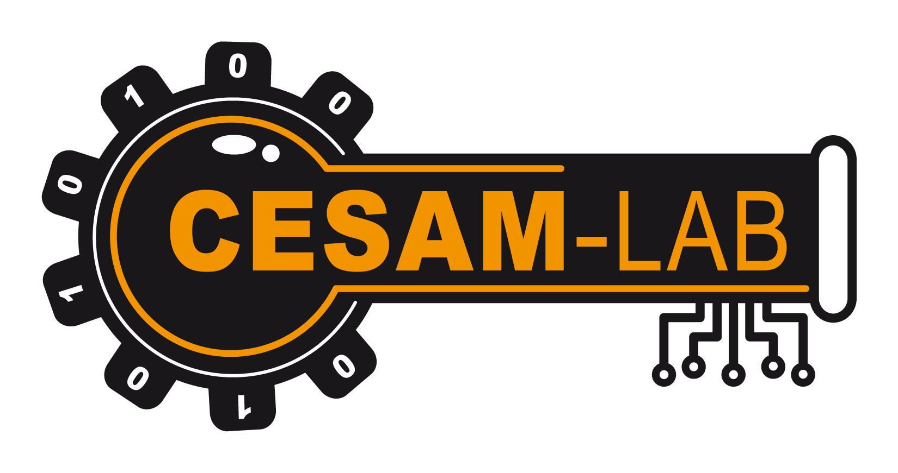

<p align="center">
  
</p>

# cesam-tools — Cassetta degli attrezzi CESAM-Lab

*🌍 [English](README.md) · [Français](README.fr.md) · [Deutsch](README.de.md) · [Español](README.es.md) · **Italiano** · [Português](README.pt.md) · [Nederlands](README.nl.md) · [Polski](README.pl.md)*

<p align="center">
  <a href="https://github.com/CESAMLAB/cesam-tools/releases/latest"></a>
  <a href="LICENSE"></a>
</p>

Workspace Rust che riunisce gli **strumenti di CESAM-Lab**, a cominciare da
**simulatori di strumenti industriali**: apparecchi virtuali che
riproducono un comportamento fisico realistico e comunicano tramite protocolli
di campo. Utile per sviluppare, testare e dimostrare supervisori, PLC
o gateway **senza hardware reale**.

> Distribuito gratuitamente sotto licenza [MIT](LICENSE).

## Strumenti disponibili

| Crate | Prodotto | Descrizione | Protocollo | IHM |
|-------|---------|-------------|-----------|-----|
| [`mock_bin_ru_modbustcp`](mock_bin_ru_modbustcp) | **ORME** | Regolatore (PID / TOR / PWM) su funzione di trasferimento | Modbus TCP & RTU (slave) | egui |
| [`mock_bin_su_namur`](mock_bin_su_namur) | **OSNE** | Agitatore da laboratorio sospeso: funzione di trasferimento del motore, regolazione rapida della velocità, carico viscoso regolabile | NAMUR su TCP & seriale RS-232 (slave) | egui |
| [`mock_bin_ru_opcua`](mock_bin_ru_opcua) | **ORUE** | Regolatore di processo (PID anti-windup) su processo del primo ordine, con sicurezza OPC UA configurabile | OPC UA (server) | egui |

Libreria condivisa:

| Crate | Descrizione |
|-------|-------------|
| [`mock_lib_control`](mock_lib_control) | Blocchi di regolazione riutilizzabili: PID anti-windup, tutto-o-niente a isteresi, processo del 1° ordine + ritardo puro (FOPDT). |

## ORME — il regolatore simulato

<p align="center">
  
</p>

> **ORME** — *Open Regulator Modbus Emulator*. **«Aprite il bus.»**
> Un regolatore di campo che esiste solo sul vostro bus Modbus.

Un regolatore industriale virtuale completo:

- **Processo** modellato da una funzione di trasferimento del primo ordine con
  ritardo puro `K·e^(-Ls) / (1 + T·s)` (tipico di un forno o bagno termostatato).
- **Regolazione** bidirezionale: verso 1 (caldo) e verso 2 (freddo),
  ciascuno configurabile in **PID**, **tutto-o-niente (TOR)** o **relè a ciclo (PWM)**.
- **Modalità** marcia/arresto e automatico/manuale.
- **Server Modbus** in **TCP** o **RTU seriale / RS485** (feature `rtu`), a scelta.
  Tabella di indirizzi (setpoint, misura, uscita, modalità…), **lista bianca di IP**
  (jolly `*`) configurabile a caldo, e **politica mono-master** (un solo master
  remoto alla volta; in TCP un nuovo arrivato disconnette il precedente).
- **Interfaccia grafica** su una pagina: pilotaggio, **curva di andamento**
  in tempo reale, **tabella di indirizzi Modbus live**, e un **modale Parametri**
  (trasporto TCP/RTU, porta, IP autorizzate, parametri seriali, funzione di
  trasferimento, limiti di setpoint).
- **Configurazione persistita** in formato TOML (`mock_ru_modbustcp.toml`),
  ricaricata all'avvio, con pulsante di ripristino ai valori predefiniti.

### Architettura asincrona

```
        Command (cast non bloccante)           istantanea condivisa
  IHM (egui) ──────────────────────►  SimulationActor  ──────────►  IHM (lettura)
  Modbus scrittura ────────────────►   (ractor)         ──────────►  immagine Modbus
  Modbus lettura  ◄──────────────────────────────────────  immagine Modbus
```

- **`ractor`**: un attore unico possiede lo stato del regolatore; tutte le
  mutazioni passano per messaggi (nessun lock sulla logica di business).
- **`tokio-modbus`**: server Modbus TCP e RTU seriale (trait `Service`).
- **`eframe`/`egui`**: interfaccia grafica sul thread principale.

## OSNE — l'agitatore da laboratorio simulato

<p align="center">
  
</p>

> **OSNE** — *Open Stirrer NAMUR Emulator*.
> Un agitatore da laboratorio sospeso (stile IKA) che esiste solo sulla vostra
> connessione NAMUR.

Un agitatore da laboratorio virtuale completo:

- **Motore** modellato da una funzione di trasferimento rotazionale `J·dω/dt = T −
  k·η·ω − attrito` (Eulero esplicito), con un **PID rapido** che pilota la coppia
  per inseguire il setpoint di velocità.
- **Viscosità regolabile** `η`: aumenta la coppia di carico; ad alta viscosità il
  motore satura e il setpoint diventa irraggiungibile (**sovraccarico**) — come un
  agitatore reale.
- **Server NAMUR** (protocollo di comandi ASCII) su **TCP** (test senza hardware)
  o **seriale RS-232** (feature `serial`), con un **watchdog** per sessione
  (`OUT_WD1@<m>`), politica **mono-master** e una **lista bianca di IP** (TCP).
- **Interfaccia grafica** su una pagina: setpoint di velocità, viscosità, **curva
  di andamento** live di velocità/coppia, un **mini-terminale NAMUR** integrato
  (invio/ispezione delle trame con cronologia dei comandi) e un **modale Parametri**
  (trasporto TCP/seriale, parametri del motore, limiti, i18n in 8 lingue).
- **Configurazione persistita** in formato TOML (`mock_su_namur.toml`), ricaricata
  all'avvio, con pulsante di ripristino ai valori predefiniti.

Condivide l'architettura di ORME (modello di business sincrono, attori `ractor`,
IHM `egui`). Avvialo con `cargo run -p mock_bin_su_namur`; il server NAMUR ascolta
su `0.0.0.0:4001` per impostazione predefinita.

## ORUE — il regolatore OPC UA simulato

<p align="center">
  
</p>

> **ORUE** — *Open Regulator UA Emulator*. **«Unificate il processo.»**
> Un regolatore di processo che esiste solo nel vostro spazio di indirizzi OPC UA.

Un regolatore di processo virtuale completo:

- **Processo** modellato da una funzione di trasferimento del primo ordine pilotata
  da un **PID anti-windup**, con passo ogni 0,5 s.
- **Server OPC UA** (`async-opcua`, nativo Tokio, crittografia 100% Rust — senza
  OpenSSL, stack con licenza MPL-2.0). **Sicurezza configurabile** (`SecurityConfig`):
  `None`/anonimo per impostazione predefinita (avvio istantaneo) **oppure**
  `Basic256Sha256` / SignAndEncrypt con un certificato autofirmato (`pki/`, generato
  alla prima esecuzione cifrata), più token anonimo e/o **utente/password**.
- **Una postura diversa da ORME/OSNE**: la sicurezza OPC UA si basa su
  **certificato + autenticazione**, non su una lista bianca di IP (non ce n'è
  **alcuna**); il server accetta **più sessioni client simultanee** (nessun
  mono-master, vince l'ultimo che scrive). Il valore predefinito `None`/anonimo su
  `0.0.0.0:4840` è il più aperto del workspace — un banner IHM avverte ogni volta
  che la cifratura è disattivata.
- **Interfaccia grafica** su una pagina: pilotaggio, **curva di andamento** in tempo
  reale, e un **modale Parametri** (rete, funzione di trasferimento del processo,
  guadagni PID, limiti di setpoint, sicurezza, i18n in 8 lingue).
- **Configurazione persistita** in formato TOML (`mock_ru_opcua.toml`), ricaricata
  all'avvio, con pulsante di ripristino ai valori predefiniti.

Condivide l'architettura di ORME (modello di business sincrono, attori `ractor`,
IHM `egui`). Avvialo con `cargo run -p mock_bin_ru_opcua`; il server OPC UA ascolta
su `0.0.0.0:4840` per impostazione predefinita. Lo spazio di indirizzi è documentato
in [`mock_bin_ru_opcua/docs/it/reference_opcua.md`](mock_bin_ru_opcua/docs/it/reference_opcua.md).

## Download

I binari precompilati sono disponibili nella pagina [**Releases**](https://github.com/CESAMLAB/cesam-tools/releases/latest) — **nessuna toolchain Rust necessaria**. Ogni strumento ha il proprio eseguibile (`orme`, `osne`, `ru_opcua`).

**ORME** (regolatore Modbus):

| Piattaforma | GUI | Headless (solo TCP, senza GUI) |
|----------|-----|-----------------------------|
| Linux x86_64 | [`orme-linux-x86_64`](https://github.com/CESAMLAB/cesam-tools/releases/latest/download/orme-linux-x86_64) | [`orme-linux-x86_64-headless`](https://github.com/CESAMLAB/cesam-tools/releases/latest/download/orme-linux-x86_64-headless) |
| Windows x86_64 | [`orme-windows-x86_64.exe`](https://github.com/CESAMLAB/cesam-tools/releases/latest/download/orme-windows-x86_64.exe) | — |
| Raspberry Pi arm64 (Pi OS 64-bit) | [`orme-rpi-arm64`](https://github.com/CESAMLAB/cesam-tools/releases/latest/download/orme-rpi-arm64) | [`orme-rpi-arm64-headless`](https://github.com/CESAMLAB/cesam-tools/releases/latest/download/orme-rpi-arm64-headless) |

**OSNE** (agitatore da laboratorio NAMUR):

| Piattaforma | GUI | Headless (solo TCP, senza GUI) |
|----------|-----|-----------------------------|
| Linux x86_64 | [`osne-linux-x86_64`](https://github.com/CESAMLAB/cesam-tools/releases/latest/download/osne-linux-x86_64) | [`osne-linux-x86_64-headless`](https://github.com/CESAMLAB/cesam-tools/releases/latest/download/osne-linux-x86_64-headless) |
| Windows x86_64 | [`osne-windows-x86_64.exe`](https://github.com/CESAMLAB/cesam-tools/releases/latest/download/osne-windows-x86_64.exe) | — |
| Raspberry Pi arm64 (Pi OS 64-bit) | [`osne-rpi-arm64`](https://github.com/CESAMLAB/cesam-tools/releases/latest/download/osne-rpi-arm64) | [`osne-rpi-arm64-headless`](https://github.com/CESAMLAB/cesam-tools/releases/latest/download/osne-rpi-arm64-headless) |

**ORUE** (regolatore OPC UA):

| Piattaforma | GUI | Headless (solo TCP, senza GUI) |
|----------|-----|-----------------------------|
| Linux x86_64 | [`ru_opcua-linux-x86_64`](https://github.com/CESAMLAB/cesam-tools/releases/latest/download/ru_opcua-linux-x86_64) | [`ru_opcua-linux-x86_64-headless`](https://github.com/CESAMLAB/cesam-tools/releases/latest/download/ru_opcua-linux-x86_64-headless) |
| Windows x86_64 | [`ru_opcua-windows-x86_64.exe`](https://github.com/CESAMLAB/cesam-tools/releases/latest/download/ru_opcua-windows-x86_64.exe) | — |
| Raspberry Pi arm64 (Pi OS 64-bit) | [`ru_opcua-rpi-arm64`](https://github.com/CESAMLAB/cesam-tools/releases/latest/download/ru_opcua-rpi-arm64) | [`ru_opcua-rpi-arm64-headless`](https://github.com/CESAMLAB/cesam-tools/releases/latest/download/ru_opcua-rpi-arm64-headless) |

```bash
chmod +x orme-linux-x86_64        # Linux / Raspberry Pi (lo stesso per osne-*, ru_opcua-*)
./orme-linux-x86_64
```

I binari Linux/RPi sono collegati dinamicamente a glibc e richiedono un ambiente desktop (X11/Wayland) per la GUI. Su **Wayland**, installa la voce desktop per l'icona nella barra delle applicazioni: `scripts/install-desktop.sh`. Verifica l'integrità con i checksum pubblicati:

```bash
sha256sum -c SHA256SUMS
```

## Avvio rapido

```bash
# Prerequisiti : Rust stable (edizione 2021, >= 1.85).
# Dipendenze di sistema Linux per l'IHM : libxkbcommon, libwayland/xcb, openGL.

cargo run -p mock_bin_ru_modbustcp
```

La finestra si apre e il server Modbus TCP ascolta su `0.0.0.0:5502`.
La **porta**, l'**IP di ascolto** e la **lista bianca di IP** si regolano nel
modale **⚙ Parametri** (applicato a caldo) poi sono **persistiti** in
`mock_ru_modbustcp.toml`. La **lingua dell'interfaccia** (francese, inglese,
tedesco, spagnolo, italiano, portoghese, olandese, polacco) si sceglie in questo
stesso modale ed è persistita. Per usare un altro file di configurazione:

```bash
MOCK_CONFIG=/percorso/verso/ma_config.toml cargo run -p mock_bin_ru_modbustcp
```

### Testare la connessione Modbus

Con qualsiasi client Modbus (es. `mbpoll`):

```bash
# Mettere in marcia (bobina 0) poi leggere la misura (input registers 0-1, f32)
mbpoll -m tcp -a 1 -t 0 -p 5502 127.0.0.1 1      # scrivere la bobina On/Off
mbpoll -m tcp -a 1 -t 3:float -r 1 -p 5502 127.0.0.1   # leggere PV (f32)
```

La tabella di indirizzi completa è documentata in
[`mock_bin_ru_modbustcp/src/map.rs`](mock_bin_ru_modbustcp/src/map.rs).

## Sviluppo

```bash
cargo test --workspace      # test unitari + integrazione
cargo clippy --workspace    # lint
```

## Documentazione

Ogni strumento ha la propria documentazione nella sua sottocartella `docs/`,
disponibile in otto lingue (`docs/<lingua>/`). Versioni italiane:

**ORME** (regolatore Modbus):

- [**Manuale utente**](mock_bin_ru_modbustcp/docs/it/manuel_utilisateur.md) — guida introduttiva, IHM, parametri, FAQ.
- [Documento di progettazione](mock_bin_ru_modbustcp/docs/it/conception.md) — architettura e scelte tecniche.
- [Tabella di indirizzi Modbus](mock_bin_ru_modbustcp/docs/it/table_modbus.md) — piano di indirizzamento completo.
- [Manutenzione software](mock_bin_ru_modbustcp/docs/it/maintenance.md) — build, configurazione, estensione, risoluzione dei problemi.

**OSNE** (agitatore da laboratorio NAMUR):

- [**Manuale utente**](mock_bin_su_namur/docs/it/manuel_utilisateur.md) — guida introduttiva, IHM, mini-terminale NAMUR, parametri, FAQ.
- [Documento di progettazione](mock_bin_su_namur/docs/it/conception.md) — modello del motore, anello di regolazione, architettura.
- [Set di comandi NAMUR](mock_bin_su_namur/docs/it/commandes_namur.md) — riferimento del protocollo (canali, comandi, esempi).
- [Manutenzione software](mock_bin_su_namur/docs/it/maintenance.md) — build, configurazione, estensione, risoluzione dei problemi.

**ORUE** (regolatore OPC UA):

- [**Manuale utente**](mock_bin_ru_opcua/docs/it/manuel_utilisateur.md) — guida introduttiva, IHM, connessione di un client OPC UA, FAQ.
- [Documento di progettazione](mock_bin_ru_opcua/docs/it/conception.md) — modello PID + processo, architettura ad attori, stack `async-opcua`, sicurezza.
- [Riferimento OPC UA](mock_bin_ru_opcua/docs/it/reference_opcua.md) — endpoint, namespace, nodi (letture/scritture, esempi).
- [Manutenzione software](mock_bin_ru_opcua/docs/it/maintenance.md) — build, configurazione, estensione, risoluzione dei problemi.

## Marchio & loghi

I loghi sono in [`pic/`](pic/):

- [`orme-icon.svg`](pic/orme-icon.svg) / `orme-icon.png` — icona ORME (quadrante),
  anch'essa incorporata come icona di finestra dell'applicazione.
- [`orme-logo.svg`](pic/orme-logo.svg) — logo ORME completo (icona + testo).
- [`osne-icon.svg`](pic/osne-icon.svg) / `osne-icon.png` — icona OSNE (girante
  agitatore), anch'essa incorporata come icona di finestra di OSNE.
- [`osne-logo.svg`](pic/osne-logo.svg) — logo OSNE completo (icona + testo).
- [`ru_opcua-icon.svg`](pic/ru_opcua-icon.svg) / `ru_opcua-icon.png` — icona ORUE
  (quadrante del regolatore racchiuso in un anello di nodo OPC UA), anch'essa
  incorporata come icona di finestra di ORUE.
- [`ru_opcua-logo.svg`](pic/ru_opcua-logo.svg) — logo ORUE completo (icona + testo).
- [`Logo-CESAM-Couleur-vect.png`](pic/Logo-CESAM-Couleur-vect.png) — logo CESAM-Lab.

Ogni icona è **generata** dal proprio script `*-logo.gen.py`
([`pic/orme-logo.gen.py`](pic/orme-logo.gen.py),
[`pic/osne-logo.gen.py`](pic/osne-logo.gen.py),
[`pic/ru_opcua-logo.gen.py`](pic/ru_opcua-logo.gen.py)). Gli script OSNE e ORUE
rasterizzano inoltre direttamente il proprio `-icon.png` (tramite Pillow); l'`.svg`
di ORME viene rasterizzato in seguito.

Sotto **Wayland**, installare l'icona della barra delle applicazioni di uno
strumento con `scripts/install-desktop.sh [orme|osne|ru_opcua]`.

## Licenza

[MIT](LICENSE) © 2026 CESAM-Lab

I componenti di terze parti integrati in alcuni strumenti sono distribuiti sotto le proprie licenze (in particolare lo stack OPC UA con licenza MPL-2.0 utilizzato da `mock_bin_ru_opcua`); vedere [NOTICE](NOTICE). Non modificano la licenza MIT del codice di cesam-tools.
